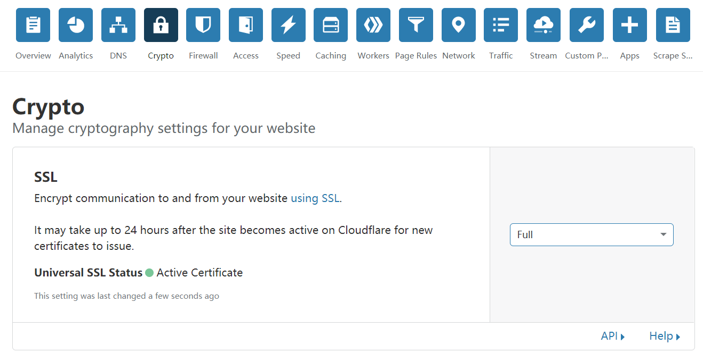

## 前言

1. 本教程目的：安装v2ray(WebSocket + TLS),当然你也可以安装其他的，比如直接Tcp，但是WebSocket + TLS的好处是即使Ip被BAN了仍然可用
2. 事先准备  
    * [vps](./vps.md)，linux系统，国外ip.
    * 域名，推荐[Freenom](https://freenom.com)
    * 域名解析到您的服务器ip，推荐[Cloudflare](https://Cloudflare.com)


## V2ray安装脚本
```
bash <(curl -s -L https://git.io/v2ray.sh)
```
如果提示 curl: command not found ，那是因为你的 VPS 没装 Curl
ubuntu/debian 系统安装 Curl 方法: 
```
apt-get update -y && apt-get install curl -y
```

centos 系统安装 Curl 方法: 
```
yum update -y && yum install curl -y
```

## 参考
```

........... V2Ray 一键安装脚本 & 管理脚本 by 233v2.com ..........

帮助说明: https://233v2.com/post/1/

搭建教程: https://233v2.com/post/2/

 1. 安装

 2. 卸载

请选择 [1-2]:1

请选择 V2Ray 传输协议 [1-32]

  1. TCP
  2. TCP_HTTP
  3. WebSocket
  4. WebSocket + TLS
  5. HTTP/2
  6. mKCP
  7. mKCP_utp
  8. mKCP_srtp
  9. mKCP_wechat-video
 10. mKCP_dtls
 11. mKCP_wireguard
 12. QUIC
 13. QUIC_utp
 14. QUIC_srtp
 15. QUIC_wechat-video
 16. QUIC_dtls
 17. QUIC_wireguard
 18. TCP_dynamicPort
 19. TCP_HTTP_dynamicPort
 20. WebSocket_dynamicPort
 21. mKCP_dynamicPort
 22. mKCP_utp_dynamicPort
 23. mKCP_srtp_dynamicPort
 24. mKCP_wechat-video_dynamicPort
 25. mKCP_dtls_dynamicPort
 26. mKCP_wireguard_dynamicPort
 27. QUIC_dynamicPort
 28. QUIC_utp_dynamicPort
 29. QUIC_srtp_dynamicPort
 30. QUIC_wechat-video_dynamicPort
 31. QUIC_dtls_dynamicPort
 32. QUIC_wireguard_dynamicPort

备注1: 含有 [dynamicPort] 的即启用动态端口..
备注2: [utp | srtp | wechat-video | dtls | wireguard] 分别伪装成 [BT下载 | 视频通话 | 微信视                                                                       频通话 | DTLS 1.2 数据包 | WireGuard 数据包]

(默认协议: TCP):4


 V2Ray 传输协议 = WebSocket + TLS
----------------------------------------------------------------


请输入 V2Ray 端口 [1-65535]，不能选择 80 或 443 端口
(默认端口: 60536):


 V2Ray 端口 = 60536
----------------------------------------------------------------


请输入一个 正确的域名，一定一定一定要正确，不！能！出！错！
(例如：233blog.com): yourdomain


 你的域名 = yourdomain
 
 
(是否已经正确解析: [Y]): y


 域名解析 = 我确定已经有解析了
 ```

 备注...如果你的域名是使用 Cloudflare 解析的话..在 Status 那里点一下那图标..让它变灰


```
----------------------------------------------------------------


                安装 Caddy 来实现 自动配置 TLS

                如果你已经安装 Nginx 或 Caddy

                并且..自己能搞定配置 TLS

                那么就不需要 打开自动配置 TLS

----------------------------------------------------------------

(是否自动配置 TLS: [Y/N]): Y


 自动配置 TLS = 打开
----------------------------------------------------------------


是否开启 网站伪装 和 路径分流 [Y/N]
(默认: [N]): N


 网站伪装 和 路径分流 = 不想配置
----------------------------------------------------------------


是否开启广告拦截(会影响性能) [Y/N]
(默认 [N]): N


 广告拦截 = 关闭
----------------------------------------------------------------

是否配置 Shadowsocks [Y/N]
(默认 [N]): N

Shadowsocks = 未配置
----------------------------------------------------------------


 ....准备安装了咯..看看有毛有配置正确了...

---------- 安装信息 -------------

 V2Ray 传输协议 = WebSocket + TLS

 V2Ray 端口 = 60536

 你的域名 = yourdomain

 域名解析 = 我确定已经有解析了

 自动配置 TLS = 打开

 是否配置 Shadowsocks = 未配置

---------- END -------------

按 Enter 回车键 继续....或按 Ctrl + C 取消.

V2Ray 客户端使用教程: https://233v2.com/post/4/

提示: 输入 v2ray url 可生成 vmess URL 链接 / 输入 v2ray qr 可生成二维码链接

[root@11 ~]#v2ray url


```

## 别忘了

在加密里面选择FULL(只允许Https连接)

记得点亮DNS那个小云

